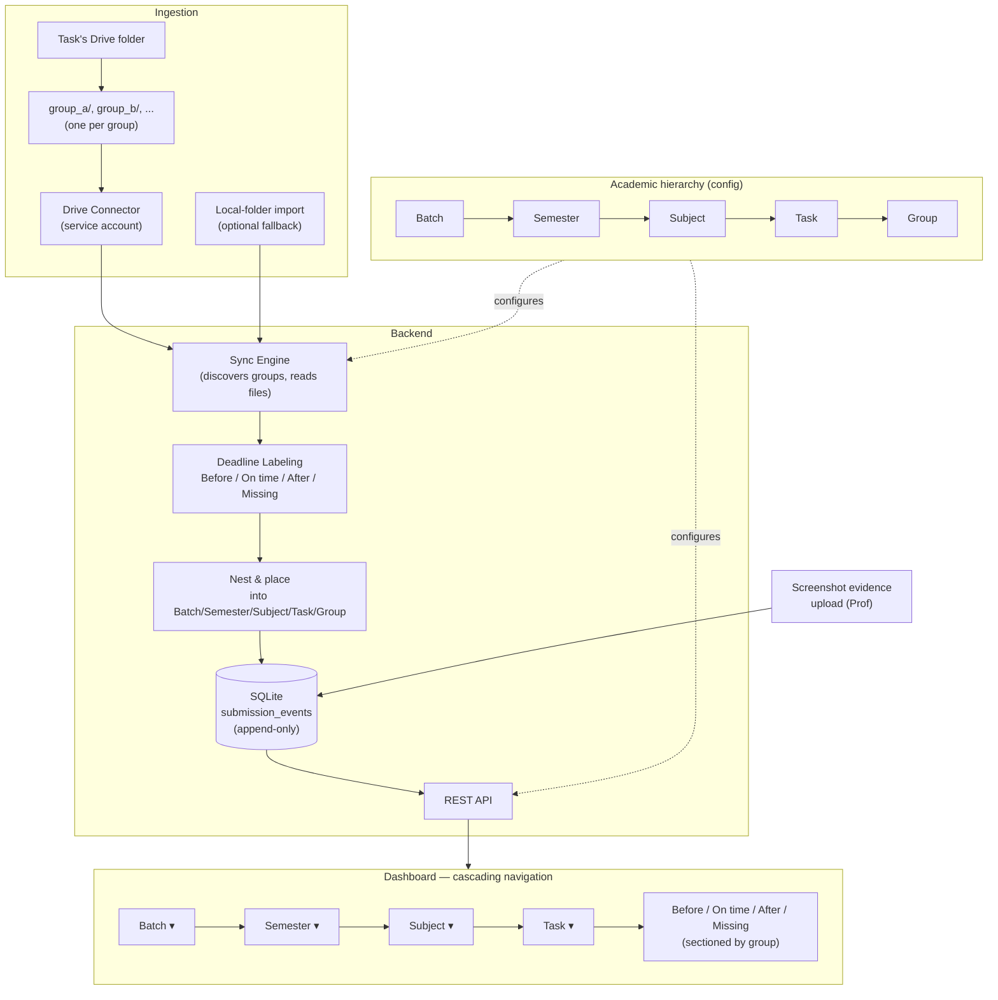

# Architecture

## Terminology note

What the earlier pass called a **Component** is now the product-facing **Task** — the unit the
Prof actually creates: one Task = one Subject's submission-bearing unit, with its own Drive
link and deadline. The hierarchy is now **Batch → Semester → Subject → Task → Group**.
(Non-submission components, like exams, simply aren't modeled as Tasks — this platform is
scoped to the submission-bearing units.)

## Task creation form

The concrete unit of work the Prof interacts with:

| Field | Type | Notes |
|---|---|---|
| Subject name | text, autocomplete against existing subjects in the selected semester | Creates the subject inline if it doesn't already exist — no separate "add subject" screen needed |
| Task name | text (placeholder text like *"e.g., Assignment 1"* to guide input) | |
| Drive submission link | URL | The folder the Prof already shares by email. Backend extracts the Drive folder ID from the pasted URL server-side — Prof never has to find the ID manually |
| Deadline | date **+ exact time** | Native `<input type="datetime-local">` — see [design-options.md §7](design-options.md#7-deadlinetime-picker-ui) |

Batch and Semester are selected as context above this form (they're the dropdowns the Prof is
already navigating through), not re-entered per task.

## Drive submission structure

Confirmed by this pass: submissions are **group-wise subfolders inside the Task's Drive link**,
not flat files with group names embedded in the filename:

```
<Task's Drive submission link>/
  group_a/
    solution.pdf
    diagram.png
  group_b/
    report.docx
  ...
```

This is more reliable than filename parsing — group identity is the subfolder name, not
something extracted from free-text filenames.

## Component breakdown

- **Academic hierarchy (config)** — Batch → Semester (fixed 4) → Subject (autocompleted/created
  inline) → Task → Group. Group rows are **auto-registered by discovery** (see
  [design-options.md §3](design-options.md#3-️-where-does-group-identity-come-from)) — the Prof
  doesn't pre-populate a roster before submissions start arriving.
- **Drive submission folder** — one per Task, containing one subfolder per group.
- **Drive Connector** — service-account based (unchanged mechanism from `../web-app`), now
  scanning two levels: list subfolders of the Task folder (= groups), then list files inside
  each group subfolder.
- **Local-folder import (optional)** — fallback ingestion path reading the Prof's existing
  manual nested folders, same two-level shape (task folder → group subfolder).
- **Sync engine** — for each Task, discovers group subfolders (auto-registering new ones),
  reads their files, and for each file: computes its label and **places the record into the
  nested hierarchy** (Batch/Semester/Subject/Task/Group) with that label attached. This step is
  the automated replacement for the Prof's manual "download and create nested folders."
- **Deadline labeling** — Before / On time / After, computed from `deadline_at` (exact
  date+time) and each Task's on-time window.
- **Evidence store** — Prof-attached screenshots, linked to a Task (and optionally a group).
- **SQLite append-only audit log** — unchanged pattern: `submission_events` rows are immutable
  once written.
- **REST API** — serves the hierarchy for cascading dropdowns, and per-task submission lists
  already sub-grouped by label.
- **Dashboard frontend** — Batch → Semester → Subject → Task cascading dropdowns, landing on a
  submissions view for the selected Task, itself sectioned by label (Before / On time / After /
  Missing), each section listing its groups.

## Diagram



## What changed vs. the previous (flat roster) build

| | Previous (`web-app`) | This revamp |
|---|---|---|
| Structure | Flat: students × assignments | 5-level hierarchy: Batch → Semester → Subject → Task → Group |
| Submitter unit | Individual student | Group, identified by Drive **subfolder name** (auto-discovered) |
| Navigation | Single dashboard table | Cascading dropdowns → submissions view sectioned by label |
| Status labels | On time / Late / Missing | Before / On time / After (+ Missing) |
| Deadline precision | Date only | Exact date **and** time, via a date/time picker |
| Drive structure | One folder per assignment, filenames carry student identity | One folder per Task, one subfolder per group inside it |
| Group registration | Admin pre-registers roster | Auto-registered on first discovery; roster enrichment is optional and additive |
| Evidence | Drive link only | Drive link **+** Prof-attached screenshot |

The append-only audit log, SQLite choice, and connector mechanics carry over unchanged.
