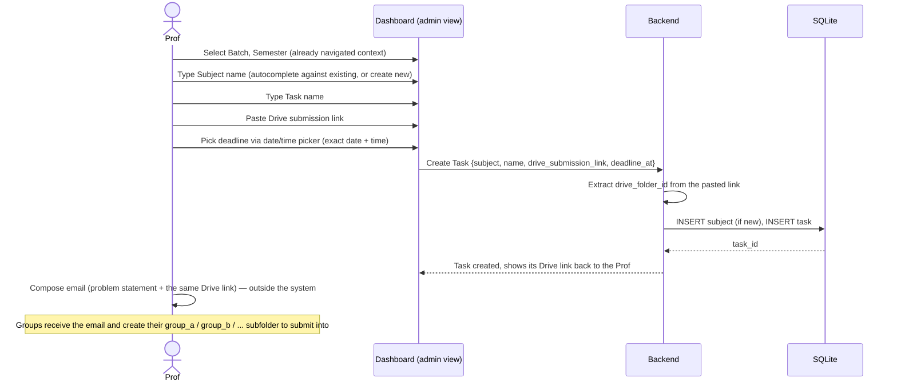
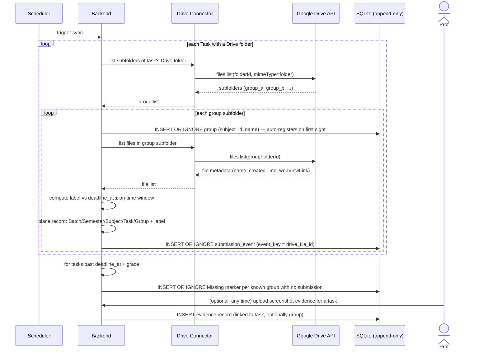
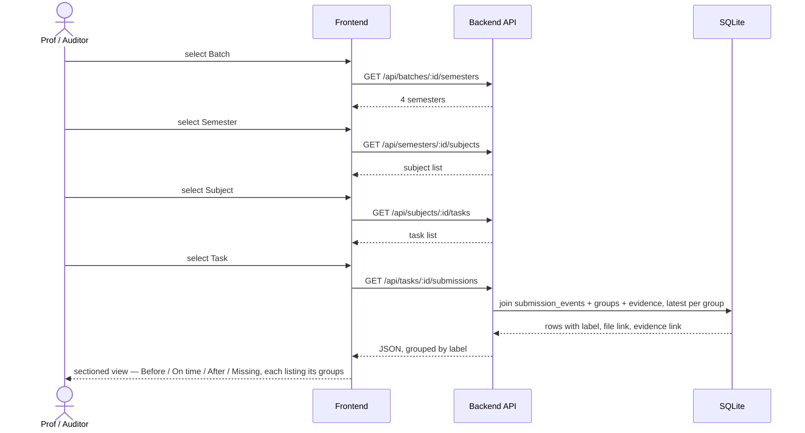
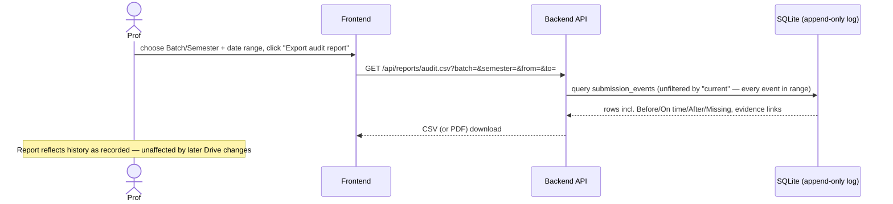

# Sequence Flows

Four flows: creating a task, capturing submissions, browsing the dashboard, and exporting an
audit report. Each names the option it assumes where [design-options.md](design-options.md)
has alternatives — swap the step if you pick a different option there.

## 1. Task creation & distribution

## 2. Submission capture (recurring sync)

## 3. Dashboard browsing (cascading dropdowns → sectioned view)

## 4. Audit report export

